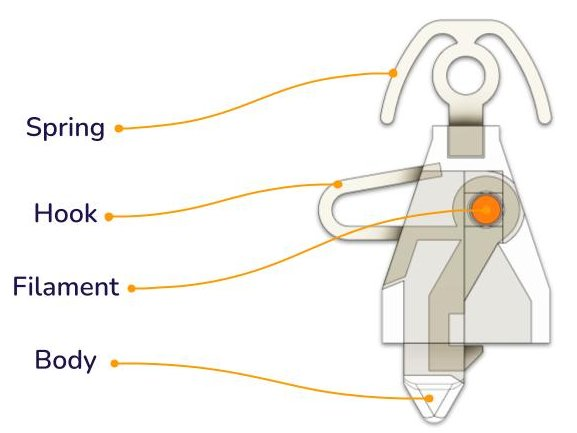

# AutoCoupler
Automatic coupler with easy release mechanism designed for 3D printed model trains. 

All Dragon Railway [Locomotives](locomotives.md) and [Wagons](wagons.md) use the AutoCoupler.

{: style="height:300px"}

**Assembly Manual:** [Google docs](https://docs.google.com/presentation/d/1HCa2KOX2yyTP7SEmd7yx5nFiLvS1uLYHvnnm2TKEdmc)

**3D print files:** [printables.com](https://www.printables.com/model/346775)

{: style="height:300px"}

