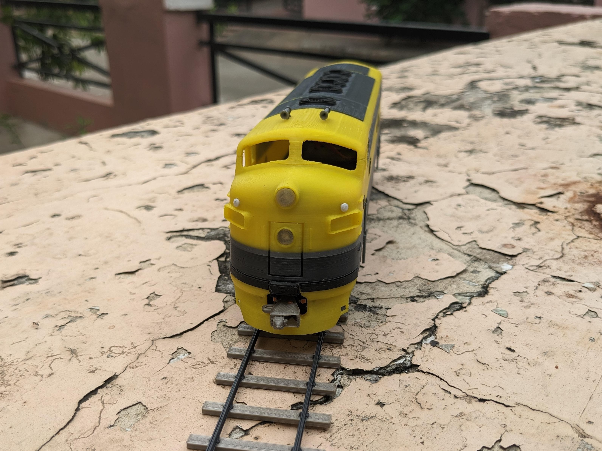

# Official Locomotives
## 1) Dragon F7 (==Open Source==)
Scale model of [EMD F7 locomotive](https://en.wikipedia.org/wiki/EMD_F7)

The **EMD F7** is a model of 1,500-horsepower (1,100 kW) diesel-electric locomotive produced between February 1949 and December 1953 by the Electro-Motive Division of General Motors (EMD) and General Motors Diesel (GMD).

{: style="height:400px"}

{: style="height:200px"}
{: style="height:200px"}

**Assembly Manual:** [Google docs](https://docs.google.com/presentation/d/1AxjxZsO5vrXmXC-GFSj-jBn4ESSynoftXoCb3mvGecE)

**Hardware required:**

- N20 Motor (6V 1000RPM) - 2pcs
- M2 6mm screw - 10pcs

**3D print files:** [printables.com](https://www.printables.com/model/346667)

**Source CAD Files:** [github.com](https://github.com/DragonRailway/Locomotives)
