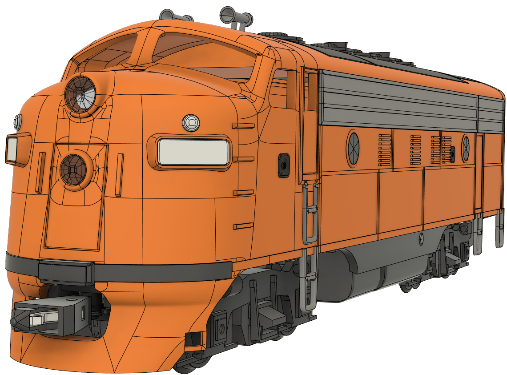
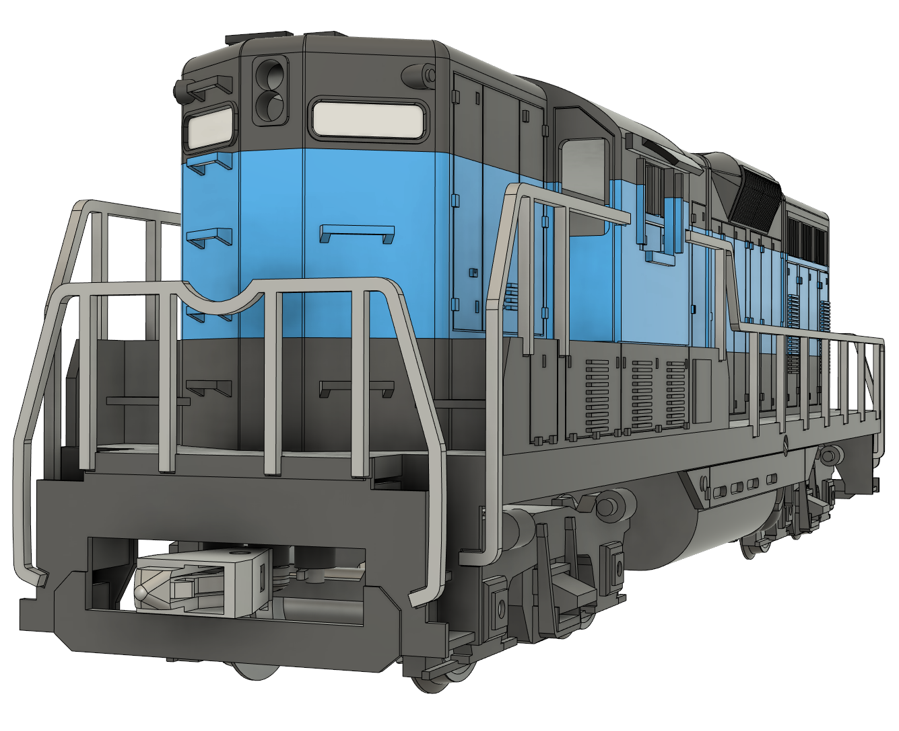

# Official Locomotives
## ==Open Source== Locomotives

### 1) Dragon F7
Scale model of [EMD F7 locomotive](https://en.wikipedia.org/wiki/EMD_F7)
???+ note "Info"
    The **EMD F7** is a model of 1,500-horsepower (1,100 kW) diesel-electric locomotive produced between February 1949 and December 1953 by the Electro-Motive Division of General Motors (EMD) and General Motors Diesel (GMD).

{: style="width:500px"}
{: style="width:400px"}

**Compatible Track radius:** Min 300mm

**Assembly Manual:** [Google docs](https://docs.google.com/presentation/d/1AxjxZsO5vrXmXC-GFSj-jBn4ESSynoftXoCb3mvGecE)

**3D print files:** [printables.com](https://www.printables.com/model/346667)

**Source CAD Files:** [github.com](https://github.com/DragonRailway/Locomotives)

### 2) Dragon GP7
Scale model of [EMD GP7 locomotive](https://en.wikipedia.org/wiki/EMD_GP7)
???+ note "Info"
    The **EMD GP7** is a model of 1,500-horsepower (1,119 kW) four-axle (B-B) diesel-electric locomotive produced between February 1949 and December 1954. The GP7 was the first EMD road locomotive to use a hood unit design instead of a car-body design.

{: style="width:400px"}

**Compatible Track radius:** Min 350mm

**Assembly Manual:** [Google docs](https://docs.google.com/presentation/d/10gpAxvzbVgcxRMDhrzigqd9DzizsOUEcOxRqNQ-RSH4)

**3D print files:** to be uploaded

